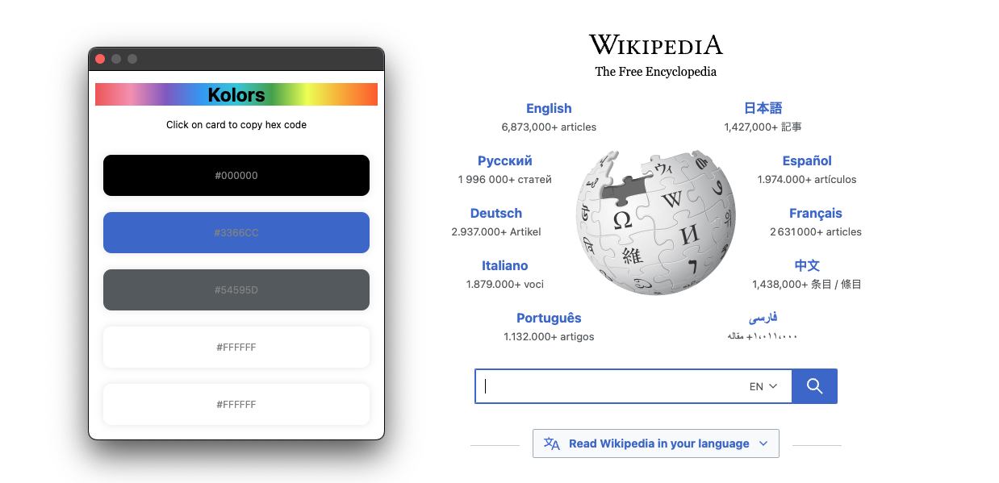

# Kolors

A browser extension that helps you get colors used in a website.

## Attributions

- RGBA to Hex Util by [Rob Garrision](https://wowmotty.blogspot.com/2017/05/convert-rgba-output-to-hex-color.html)
- Vectors and icons by <a href="https://github.com/andreasbm/web-skills/?ref=svgrepo.com" target="_blank">Andreas Mehlsen</a> in MIT License via <a href="https://www.svgrepo.com/" target="_blank">SVG Repo</a>
